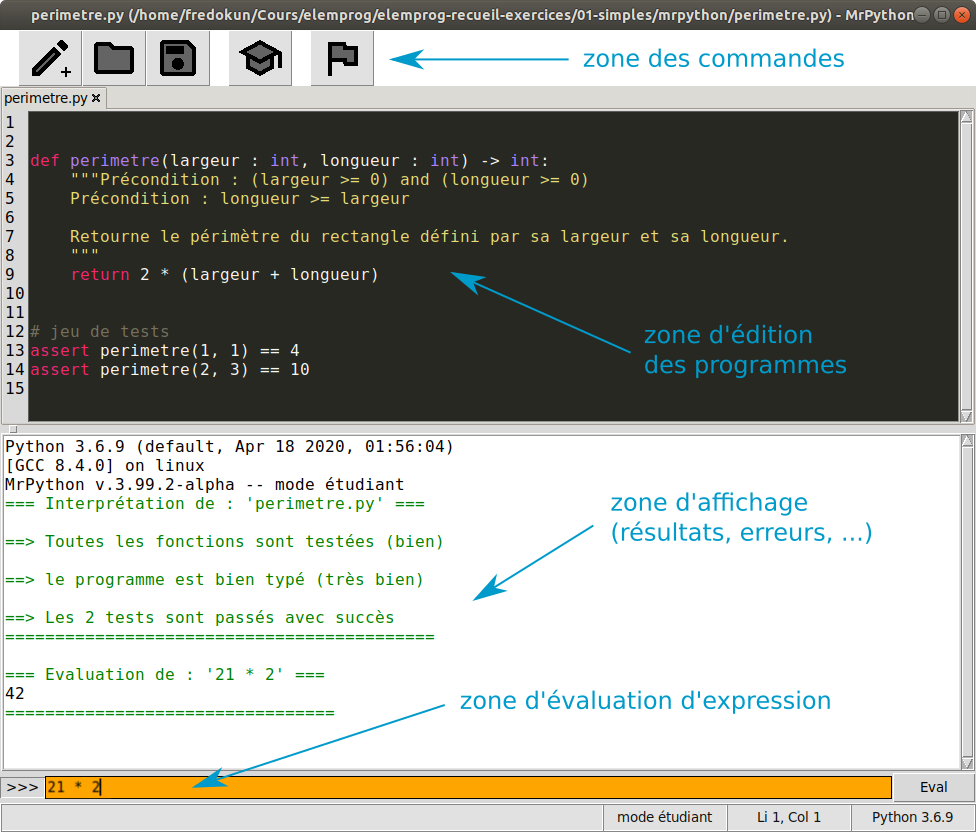

Prise en main de MrPython
=========================

MrPython est minimaliste, son interface utilisateur est donc extrêmement simple.

Au lancement de l'application, la fenêtre principale se présente ainsi :

L’environnement propose trois zones principales :

 — la **zone de commandes** qui consiste en un nombre réduit de commandes
   — créer, charger et sauvergarder un fichier Python
   — alterner entre le «mode étudiant» et le «mode expert»
   — lancer l’interprétation du programme courant
 — la **zone d’édition** qui permet de rédiger un programme Python de façon confortable
   — coloration syntaxique
   — gestion «intelligente» de l’indentation
   — commandes usuelles d’édition (Ctrl-C, Ctrl-V, etc.)
 — la zone d’interaction composée de deux «sous-zones» :
   — la **zone d’affichage** qui affiche les résultats d’évaluation, les erreurs éventuelles, etc.
   — la **zone d’évaluation** permettant de saisir une expression Python simple (sur une
ligne) et de l’évaluer (bouton Eval ou simplement retour chariot – touche Entrée).

Commandes de MrPython
---------------------

**Nouveau programme**

Cette commande permet de créer un nouveau programme Python en ouvrant un nouvel onglet dans la fenêtre d'édition de MrPython.

**Charger un programme**

Cette commande permet de charger un programme Python à partir d'un fichier portant l'extension `.py`. Dans la figure de la fenêtre principale le fichier chargé se nomme `perimetre.py`.

**Enregistrer un programme**

Cette commande permet d'enregistrer le fichier correspondant à l'onglet actif de la fenêtre d'édition.

**Astuce** : En maintenant la touche *Shift* appuyée tout en cliquant sur cette commande, on demande à MrPython d'enregistrer le programme dans un nouveau fichier (commande «Enregistrer sous ...»).

**Mode étudiant**

Si cette icône est visible (ce qui est le cas par défaut au lancement de MrPython), alors l'éditeur est en *mode étudiant*, c'est-à-dire avec un support spécial pour les annotations de type PEP-484, ainsi qu'un certain nombre de vérifications liées au livre [Eléments de programmation](https://www.editions-ellipses.fr/accueil/10671-elements-de-programmation-de-lalgorithme-au-programme-python-9782340041066.html). Une bibliothèque graphique simple est également intégrée automatiquement dans ce mode.

**Important** : le mode étudiant ne gère pas l'intégralité du langage Python et en particulier la programmation objet. De plus il requiert l'emploi des annotations de type de Python, standardisées dans le document [PEP-484](https://www.python.org/dev/peps/pep-0484/).

Si on clique sur cette icône, alors on bascule en *mode expert*.

**Mode expert**

Si cette icône est visible, alors l'éditeur est en *mode expert*, c'est-à-dire que l'intégralité du langage Python est disponible. En contrepartie, MrPython ne fait aucune vérification particulière et se content d'invoquer l'interprète Python.

**Important** : MrPython est un éditeur minimaliste à vocation purement pédagogique. Il est intéressant de passer en mode expert à certains moment, cela est notamment nécessaire pour les derniers chapitres du livre *Eléments de programmation*. En revanche, pour programmer en Python hors cadre pédagogique et à partir du niveau intermédiaire, nous conseilons fortement l'utilisation d'un outil moins minimaliste.

**Lancement du programme**

En cliquant sur cette icône, on lance le programme correspondant à l'onglet actif de la zone d'édition. Il est possible d'interrompre cette exécution avant son terme (ou lorsqu'un programme ne termine pas) en cliquant sur l'icône suivante~:

Zone d'édition des programmes
-----------------------------

L'édition des programmes se fait dans un éditeur de texte simple mais spécialisé pour le langage Python et ses particularités syntaxiques. L'éditeur gère notamment les indentations ainsi que la coloration syntaxique.

L'éditeur utilise un système d'onglets, chaque onglet correspondant soit à un nouveau programme, soit à un programme associé à un fichier spécifique et portant l'extension `.py`. Il y a toujours un unique onglet actif parmi les onglets disponibles. Toutes les commandes de MrPython portent exclusivement sur cet onglet actif. Il suffit de cliquer sur un onglet pour le rendre actif.

Il existe un certain nombre de raccourcis claviers, avec notamment :

 - Gestion du presse-papier
   - `Ctrl-c` : copier la sélection dans le presse-papier
   - `Ctrl-x` : effacer la sélection et la copier dans le presse-papier («couper»)
   - `Ctrl-v` : insérer le contenu du presse-papier à l'endroit ou se situe le curseur («couper»)
 - Commandes d'indentation :
   - `Tab` : augmenter le niveau d'indentation de la ligne courante
   - `Backspace` (devant la première lettre (autre qu'un espace) de la ligne courante) : réduire le niveau d'indentation de la ligne courante
 - Raccourcis de commandes :
   - `Ctrl-s` : sauvegarder le programme

Zone d'évaluation d'expressions
-------------------------------

Après lancement du programme Python correspondant à l'onglet actif, il est possible d'interagir avec l'interprète Python en évaluant des expressions dans la zone d'évaluation en bas de la fenêtre principale de MrPython. 
Cela est utile lorsque l'on veut tester des fonctions définies dans le programme en cours d'édition.
Les sorties correspondantes se font dans la zone d'affichage.

**Remarque** : il s'agit d'une version simplifiée de l'interprète de commandes de Python, qui est limité à l'évaluation d'expressions (calculant une valeur).

Zone d'affichage des résultats
------------------------------

La zone d'affichage est située au-dessous de la zone d'édition et juste au-dessus de la zone d'évaluation des expressions. Elle informe les utilisateurs des résultats d'interprétation des programmes Python.
Un code de couleur est employé pour catégoriser les sorties :

 - le **noir** correspond à des informations neutres, comme par exemple les valeurs, les informations de version, etc.
 - le **vert** indique qu'une étape (par exemple, le typage) de l'interprétation s'est déroulée correctement
 - l'orange correspond à un avertissement, c'est-à-dire un problème non-critique rencontré dans l'intérprétation du programme
 - le rouge identifie une erreur qui empêche le bon fonctionnement du programme. Il y a plusieurs types d'erreurs gérés par MrPython, notamment :
   - les erreurs de conventions ou de typage en mode étudiant
   - les erreurs («exceptions») signalées par l'interprète Python
   - etc.
 - le gris correspond à des affichages du programme sur la sortie standard (`stdout`), suite par exemple à l'invocation de la procédure `print` de Python.
 
 
